# Monte Carlo method

<center></center>

## Motivation: π 계산하기


### 1. 원의 둘레 측정하기

<center></center>

$$\pi= \frac{\ell}{2r}$$

### 2. 무한급수 계산하기

- Leibniz formula for π

$${\displaystyle 1-{\frac {1}{3}}+{\frac {1}{5}}-{\frac {1}{7}}+{\frac {1}{9}}-\cdots ={\frac {\pi }{4}}}$$


```python
sigma = 0
i = 1
sign = 1
while 1/i > 0.0000001 / 4:
    sigma += sign * (1 / i)
    i += 2
    sign *= -1
pi = sigma * 4
print(f"π={pi}")
```

    π=3.141592603589817
    

[List of formulae involving π](https://en.wikipedia.org/wiki/List_of_formulae_involving_%CF%80)

- Efficient infinite series

$${\displaystyle \sum _{k=0}^{\infty }{\frac {k!}{(2k+1)!!}}=\sum _{k=0}^{\infty }{\frac {2^{k}k!^{2}}{(2k+1)!}}={\frac {\pi }{2}}}$$

$${\displaystyle \sum _{k=0}^{\infty }{\frac {k!\,(2k)!\,(25k-3)}{(3k)!\,2^{k-1}}}=\pi+3 }$$

$${\displaystyle \sum _{k=0}^{\infty }{\frac {(-1)^{k}}{4^{k}}}\left({\frac {2}{4k+1}}+{\frac {2}{4k+2}}+{\frac {1}{4k+3}}\right)=\pi }$$


```python
# 1st series
sigma = 0
k = 0
fact = 1
doub_fact = 1
temp = 1
while temp > 0.00001:
    sigma += temp
    k += 1
    fact *= k
    doub_fact *= 2 * k + 1
    temp = fact / doub_fact
pi = sigma * 2
print(f"π={pi}")
```

    π=3.1415661593449467
    


```python
# 2nd series
sigma = 0
k = 0
fact = 1
fact2 = 1
fact3 = 1
exp2 = 1/2
temp = -3
while k < 100:#abs(temp) > 0.00001:
    sigma += temp
    k += 1
    fact *= k
    fact2 *= (2 * k) * (2 * k - 1)
    fact3 *= (3 * k) * (3 * k - 1) * (3 * k - 2)
    exp2 *= 2
    temp = fact * fact2 * (25 * k - 3) / fact3 / exp2
pi = sigma - 3
print(f"π={pi}")
```

    π=3.1415926535897905
    


```python
# 3rd series
sigma = 0
k = 0
exp_term = 1
temp = 10 / 3
while abs(temp) > 0.0000000000001:
    sigma += temp
    k += 1
    exp_term *= -1/4
    temp = exp_term * (2/(4*k+1) + 2/(4*k+2) + 1/(4*k+3))
pi = sigma
print(f"π={pi}")
```

    π=3.1415926535897483
    

- Other infinite series

$$ {\displaystyle \zeta (2)={\frac {1}{1^{2}}}+{\frac {1}{2^{2}}}+{\frac {1}{3^{2}}}+{\frac {1}{4^{2}}}+\cdots ={\frac {\pi ^{2}}{6}}} $$

$$ {\displaystyle \zeta (4)={\frac {1}{1^{4}}}+{\frac {1}{2^{4}}}+{\frac {1}{3^{4}}}+{\frac {1}{4^{4}}}+\cdots ={\frac {\pi ^{4}}{90}}} $$

$$ {\displaystyle \sum _{n=1}^{\infty }{\frac {(-1)^{n+1}}{n(n+1)(2n+1)}}=\pi -3} $$


```python
# 1st series
sigma = 0
i = 1
while 1/i**2 > 0.0000000000001:
    sigma += 1/i**2
    i += 1
pi = (6 * sigma) ** 0.5
print(pi)
```

    3.1415923516145474
    


```python
# 2nd series
sigma = 0
i = 1
while 1/i**4 > 0.0000000000000000000000001:
    sigma += 1/i**4
    i += 1
pi = (90 * sigma) ** 0.25
print(pi)
```

    3.141592653589592
    


```python
# 3rd series
sigma = 0
n = 1
sign = 1
temp = 1/6
while abs(temp) > 0.00000000000000000001:
    sigma += temp
    n += 1
    sign *= -1
    temp = sign / n / (n+1) / (2*n+1)
pi = sigma + 3
print(pi)
```

    3.1415926535897913
    

### 3. 확률로 계산하기: 뷔퐁의 바늘

<center></center>

프랑스의 수학자 조르주루이 르클레르 드 뷔퐁이 제시한 문제. 원주율의 값을 기하학적 확률로 계산하는 방법이다.

[어떻게 계산하나요?](https://namu.wiki/w/%EB%B7%94%ED%90%81%EC%9D%98%20%EB%B0%94%EB%8A%98)

[직접 해보기](https://www.geogebra.org/m/j2fYwDR8)


## Basic Idea

가지고 있던 주사위가 찌그러져 이 주사위를 던졌을 때 1, 2, 3, 4, 5, 6이 나올 확률을 알 수 없게 되었다. 각 숫자가 나올 확률을 알아내기 위해 물리학적 분석을 통해 이론적인 확률을 계산할 수 있겠지만, 실증적인 방법을 생각할 수 있다.

주사위를 많이 던져서 나온 숫자들의 **상대도수**(relative frequencies)를 계산하는 것이다! 주사위를 충분히 많이 던지면 상대도수가 이론적인 확률로 수렴할 것이다.

## Python review

### Modules

Modules are packages with classes and functions. You `import` a module to use it.<br>


```python
import random  # import random module

# We can now use functions from the random module
print(random.random())  # uniform real in [0,1]
print(random.randint(1,3))  # uniform integer in {1,2,3}
L=[3,4,5]
random.shuffle(L)  # uniform shuffle of a list
print(L)
print(random.sample(L,2))  # uniform sampling
```

    0.7060015855551015
    3
    [3, 5, 4]
    [4, 5]
    

If you plan to use a module often, shorten the name with `as`.


```python
import random as rnd
rnd.random()
```


    0.4049801415178007


```python
from random import random
random()
# random.random()
```


    0.42778237836412647


### `random` module

- random()


```python
import random
random.random()  # 0 이상 1 미만의 실수형 난수 생성
```


    0.4721860594613819


- randrange()


```python
random.randrange(1,7)  # 1 이상 7 미만의 정수형 난수 생성
```


    2


```python
list(range(1, 7))
```


    [1, 2, 3, 4, 5, 6]


```python
random.randrange(2)  # 0 또는 1
```


    1


```python
for _ in range(10):
    print(random.randrange(1, 7), end=" ")
```

    3 6 2 5 2 3 6 6 4 1 


```python
list(range(2))
```


    [0, 1]


- shuffle()


```python
abc = ['a', 'b', 'c', 'd', 'e']
random.shuffle(abc)
abc
```


    ['e', 'b', 'c', 'd', 'a']


- choice()


```python
menu = '쫄면', '육계장', '비빔밥'
random.choice(menu)
```


    '쫄면'


```python
menu
```


    ('쫄면', '육계장', '비빔밥')


```python
dice_nums = [1, 2, 3, 4, 5, 6]
random.choice(dice_nums)
```


    4


### Exercise: 비밀번호 만들기

다음 힌트를 이용해 영문자와 숫자를 이용해 16자리 비밀번호를 생성해보세요!


```python
import string
string.ascii_letters
```


    'abcdefghijklmnopqrstuvwxyzABCDEFGHIJKLMNOPQRSTUVWXYZ'


```python
string.digits
```


    '0123456789'


```python
random.choice('abc')
```


    'c'


```python
letters = string.ascii_letters + string.digits
letters
```


    'abcdefghijklmnopqrstuvwxyzABCDEFGHIJKLMNOPQRSTUVWXYZ0123456789'


```python
password = ''
for _ in range(16):
    password += random.choice(letters)
password
```


    'vaUwr3HQNMpj92tL'


```python
"".join(random.choice(letters) for _ in range(16))
```


    '8KdsJQL0tTspodcM'


```python
"a".join(['12', '332', '33'])
```


    '12a332a33'


## 동전 던지기 실험

동전의 앞면이 나올 확률을 구해보자! [Reference](https://lsh-story.tistory.com/71)

### Fair coin


```python
import random
import matplotlib.pyplot as plt

cnt = [0, 0]

for _ in range(100):
    cnt[0] += random.randint(0, 1)
cnt[1] = 100 - cnt[0]

# for _ in range(100):
#     temp = random.randint(0, 1)
#     cnt[0] += temp
#     cnt[1] += 1 - temp

plt.pie(cnt, labels=['tail', 'head'], autopct='%1.0f%%')

print("X: 동전을 던져 앞면이 나오면 1, 아니면 0")
print(f"P(X = 0) = {cnt[0]/100}")
print(f"P(X = 1) = {cnt[1]/100}")
print()
```

    X: 동전을 던져 앞면이 나오면 1, 아니면 0
    P(X = 0) = 0.38
    P(X = 1) = 0.62
    
    


    
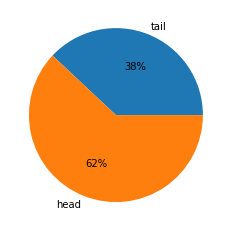
    


```python
print(['a', 'b'] * 10)
```

    ['a', 'b', 'a', 'b', 'a', 'b', 'a', 'b', 'a', 'b', 'a', 'b', 'a', 'b', 'a', 'b', 'a', 'b', 'a', 'b']
    


```python
[random.randrange(2) for _ in range(10)]
```


    [0, 1, 0, 0, 1, 1, 1, 0, 1, 1]


```python
import random
import matplotlib.pyplot as plt

res = [0] * 11
# res = [0 for _ in range(11)]

N = 10000000
for i in range(N):
    cnt = sum([random.randrange(2) for _ in range(10)])
    res[cnt] += 1

plt.bar(range(11), res,tick_label=range(11))
plt.title('coin prob')
plt.ylabel('prob')
plt.xlabel('count')

print('X: 10번 중 앞면이 나오는 횟수')
for i in range(11):
    print('P(X = %s)\t= %.5f'%(i, res[i]/N))
print()
```

    X: 10번 중 앞면이 나오는 횟수
    P(X = 0)	= 0.00097
    P(X = 1)	= 0.00980
    P(X = 2)	= 0.04394
    P(X = 3)	= 0.11713
    P(X = 4)	= 0.20507
    P(X = 5)	= 0.24606
    P(X = 6)	= 0.20528
    P(X = 7)	= 0.11707
    P(X = 8)	= 0.04396
    P(X = 9)	= 0.00972
    P(X = 10)	= 0.00099
    
    


    
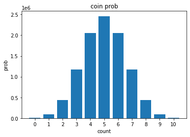
    


### Unfair coin

동전의 앞면과 뒷면이 나오는 확률이 다른 경우?!?


```python
head = 0.7  # 앞면이 나오는 확률
```


```python
random.random() < 0.7
```


    True


```python
import random
import matplotlib.pyplot as plt

res = [0] * 11
# res = [0 for _ in range(11)]

N = 100000
for i in range(N):
    cnt = sum([1 if random.random() < 0.7 else 0 for _ in range(10)])
    res[cnt] += 1

plt.bar(range(11), res,tick_label=range(11))
plt.title('coin prob')
plt.ylabel('prob')
plt.xlabel('count')

print('X: 10번 중 앞면이 나오는 횟수')
for i in range(11):
    print('P(X = %s)\t= %.5f'%(i, res[i]/N))
print()
```

    X: 10번 중 앞면이 나오는 횟수
    P(X = 0)	= 0.00001
    P(X = 1)	= 0.00009
    P(X = 2)	= 0.00133
    P(X = 3)	= 0.00923
    P(X = 4)	= 0.03719
    P(X = 5)	= 0.10340
    P(X = 6)	= 0.20125
    P(X = 7)	= 0.26682
    P(X = 8)	= 0.23322
    P(X = 9)	= 0.11983
    P(X = 10)	= 0.02763
    
    


    
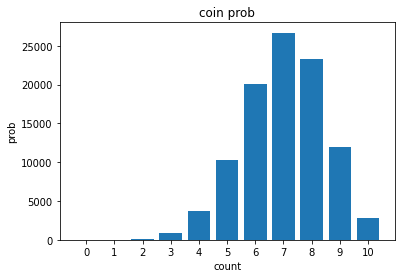
    


## 주사위 던지기 실험

주사위의 각 눈이 나올 확률을 구해보자! [Reference](https://lsh-story.tistory.com/75)

### Fair dice

주사위 1회 던지기


```python
import random
print('주사위를 던집니다.\n')
print('결과:', random.randrange(1, 7))
# print('결과:', random.randint(1, 6))
```

    주사위를 던집니다.
    
    결과: 4
    

주사위 100회 던지기


```python
print('주사위를 100회 던집니다.\n')

result = [0] * 6
for _ in range(100):
    dice = random.randrange(1,7)
    result[dice-1] += 1
    
print('결과: ')

for idx, i in enumerate(result):
    print(f"\t{idx + 1}: {i} times")
```

    주사위를 100회 던집니다.
    
    결과: 
    	1: 20 times
    	2: 12 times
    	3: 18 times
    	4: 14 times
    	5: 18 times
    	6: 18 times
    

주사위 `n`회 던지기


```python
import random
import matplotlib.pyplot as plt

def throw_dice(n, pie_plot=False):
    print(f"주사위를 {n}회 던집니다.\n")
    result = [0] * 6
    for i in range(n):
        dice = random.randint(1, 6)
        result[dice - 1] += 1
    for i in range(6):
        result[i] /= n
    plt.bar(range(1,7),result)
    plt.ylim(0,0.3)
    plt.ylabel('prob')
    plt.xlabel('dice number')
    plt.show()
    if pie_plot:
        plt.pie(result,autopct='%2.2f%%',labels=range(1,7))
        plt.show()
```


```python
throw_dice(100)
```

    주사위를 100회 던집니다.
    
    


    
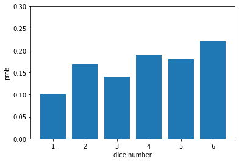
    


```python
throw_dice(1000)
```

    주사위를 1000회 던집니다.
    
    


    
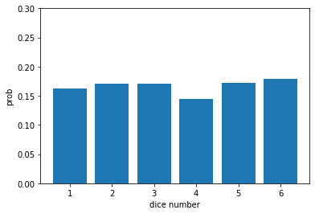
    


```python
throw_dice(10000)
```

    주사위를 10000회 던집니다.
    
    


    
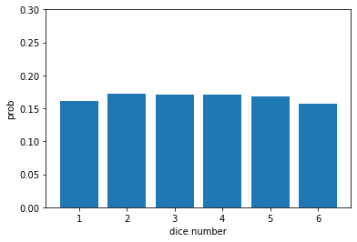
    


```python
throw_dice(100000, True)
```

    주사위를 100000회 던집니다.
    
    


    
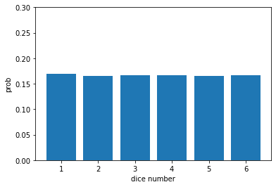
    


    
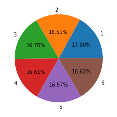
    


### Unfair dice


```python
dice_probs = [0.1, 0.2, 0.2, 0.1, 0.2, 0.2]
dice_sums = [round(sum(dice_probs[:i]),1) for i in range(1, 7)]
dice_sums
```


    [0.1, 0.3, 0.5, 0.6, 0.8, 1.0]


```python
def get_num():
    temp = random.random()
    return sum([1 if p < temp else 0 for p in dice_sums]) + 1
[get_num() for _ in range(10)]
```


    [5, 1, 3, 4, 2, 5, 6, 2, 1, 5]


```python
import random
import matplotlib.pyplot as plt

def throw_dice(n, pie_plot=False):
    print(f"주사위를 {n}회 던집니다.\n")
    result = [0] * 6
    for i in range(n):
        dice = get_num()
        result[dice - 1] += 1
    for i in range(6):
        result[i] /= n
    plt.bar(range(1,7),result)
    plt.ylim(0,0.3)
    plt.ylabel('prob')
    plt.xlabel('dice number')
    plt.show()
    if pie_plot:
        plt.pie(result,autopct='%2.2f%%',labels=range(1,7))
        plt.show()
```


```python
throw_dice(100000, True)
```

    주사위를 100000회 던집니다.
    
    


    
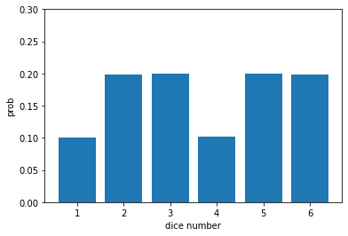
    


    
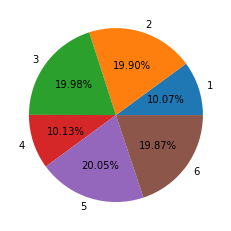
    


## 다트 실험

원주율을 구해보자! [Reference1](https://lsh-story.tistory.com/81) [Reference2](https://m.blog.naver.com/ahn_ss75/222037916011)

[원리가 궁금해요!](https://youtu.be/7ESK5SaP-bc)

### 원 그리기

$$x^2 + y^2 = 1$$


```python
import matplotlib.pyplot as plt

circle=plt.Circle((0,0),1,fc='w',ec='b') # plt의  Cricle 사용 중심, 반지름, 면적 색, 테두리색
a=plt.axes(xlim=(-1,1),ylim=(-1,1)) # x축 범위 , y축 범위를 a 변수에 할당

a.add_patch(circle) # 만들어진 a 변수(범위)에 circle patch
a.set_aspect('equal') # x ,y 비율은 같게

plt.grid(True, axis='both',color='black', alpha=1, linestyle='-') # 격자 표시
plt.show()    
```


    
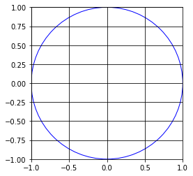
    


### 넓이(π) 구하기

[Reference](https://www.geeksforgeeks.org/estimating-value-pi-using-monte-carlo/)


```python
import random
 
INTERVAL = 1000
 
circle_points = 0
square_points = 0
 
# Total Random numbers generated= possible x
# values* possible y values
for i in range(INTERVAL**2):
 
    # Randomly generated x and y values from a
    # uniform distribution
    # Range of x and y values is -1 to 1
    rand_x = random.uniform(-1, 1)
    rand_y = random.uniform(-1, 1)
 
    # Distance between (x, y) from the origin
    origin_dist = rand_x**2 + rand_y**2
 
    # Checking if (x, y) lies inside the circle
    if origin_dist <= 1:
        circle_points += 1
 
    square_points += 1
 
    # Estimating value of pi,
    # pi= 4*(no. of points generated inside the
    # circle)/ (no. of points generated inside the square)
    pi = 4 * circle_points / square_points
 
##    print(rand_x, rand_y, circle_points, square_points, "-", pi)
# print("\n")
 
print("Final Estimation of Pi=", pi)
```

    Final Estimation of Pi= 3.139152
    


```python
import numpy as np
import matplotlib.pyplot as plt

n=1e4
x = 1-2.*np.random.random(int(n))
y = 1-2.*np.random.random(int(n))
insideX,  insideY  = x[(x*x+y*y)<=1],y[(x*x+y*y)<=1]
outsideX, outsideY = x[(x*x+y*y)>1],y[(x*x+y*y)>1]

fig, ax = plt.subplots(1)
ax.scatter(insideX, insideY, c='b', s=0.5, alpha=0.8, edgecolor=None)
ax.scatter(outsideX, outsideY, c='r', s=0.5, alpha=0.8, edgecolor=None)
ax.set_aspect('equal')
fig.show()

print(f"area: {len(insideX)/len(x)*4}")
print()
```

    area: 3.1616
    
    


    
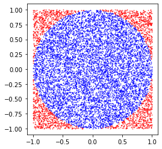
    


```python
import numpy as np
import matplotlib.pyplot as plt

n=1e4
x = 1-2.*np.random.random(int(n))
y = 1-2.*np.random.random(int(n))
insideX,  insideY  = x[(abs(x)+abs(y))<=1],y[(abs(x)+abs(y))<=1]
outsideX, outsideY = x[(abs(x)+abs(y))>1],y[(abs(x)+abs(y))>1]

fig, ax = plt.subplots(1)
ax.scatter(insideX, insideY, c='b', s=0.5, alpha=0.8, edgecolor=None)
ax.scatter(outsideX, outsideY, c='r', s=0.5, alpha=0.8, edgecolor=None)
ax.set_aspect('equal')
fig.show()

print(f"area: {len(insideX)/len(x)*4}")
print()
```

    area: 1.9968
    
    


    
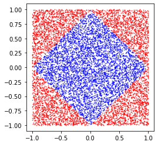
    


```python
import numpy as np
import matplotlib.pyplot as plt

n=1e4
x = 1-2.*np.random.random(int(n))
y = 1-2.*np.random.random(int(n))
insideX,  insideY  = x[(abs(x)**0.5+abs(y)**0.5)<=1],y[(abs(x)**0.5+abs(y)**0.5)<=1]
outsideX, outsideY = x[(abs(x)**0.5+abs(y)**0.5)>1],y[(abs(x)**0.5+abs(y)**0.5)>1]

fig, ax = plt.subplots(1)
ax.scatter(insideX, insideY, c='b', s=0.5, alpha=0.8, edgecolor=None)
ax.scatter(outsideX, outsideY, c='r', s=0.5, alpha=0.8, edgecolor=None)
ax.set_aspect('equal')
fig.show()

print(f"area: {len(insideX)/len(x)*4}")
print()
```

    area: 0.6756
    
    


    
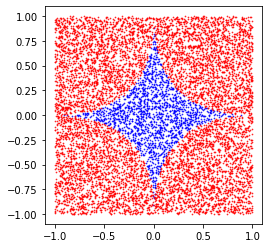
    


### Dynamic simulation


```python
%matplotlib inline
import time
import random
import pylab as pl
from IPython import display

insideX, insideY = [], []
outsideX, outsideY = [], []
pi = 0

fig, ax = plt.subplots(1)

for i in range(111):
    x, y = [random.random() * 2 - 1 for _ in range(2)]
    if x**2+y**2 <= 1:
        insideX.append(x)
        insideY.append(y)
    else:
        outsideX.append(x)
        outsideY.append(y)
    ax.scatter(insideX, insideY, c='b', s=2, alpha=0.8, edgecolor=None)
    ax.scatter(outsideX, outsideY, c='r', s=2, alpha=0.8, edgecolor=None)
    ax.set_aspect('equal')
    pi = len(insideX)/(len(insideX)+len(outsideX))*4
    plt.title(f'{i}th: π={pi:.10f}')
    fig.show()
    display.clear_output(wait=True)
    display.display(pl.gcf())
```


    
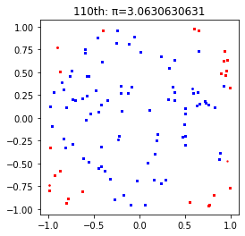
    


    

    

