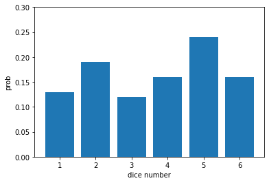
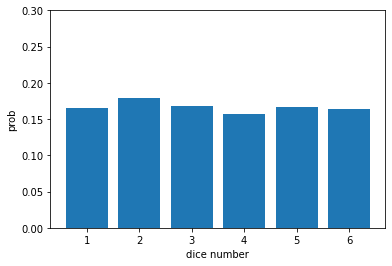
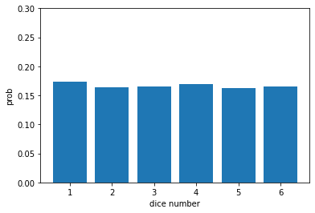
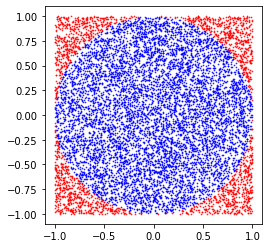
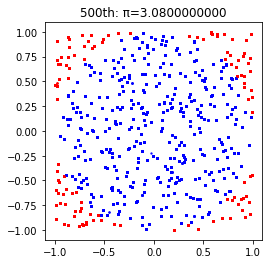

# Week 8-9

1/15/2023

16:00-18:00

## Review

### List comprehension
An intuitive and concise way to create lists.


```python
# ** power symbol
[i**2 for i in range(6)]
```


    [0, 1, 4, 9, 16, 25]


```python
[0 for _ in range(5)]  #use _ if you don't need the variable
```


    [0, 0, 0, 0, 0]


Use **if conditionals** to filter out elements


```python
[i**2 for i in range(5) if i%2==1]
```


    [1, 9]


You can use **multiple for clauses**


```python
my_list = []
for i in range(2):
    for j in range(4):
        my_list.append(i + j)
print(my_list)
```

    [0, 1, 2, 3, 1, 2, 3, 4]
    


```python
[i+j for i in range(2) for j in range(4)]
```


    [0, 1, 2, 3, 1, 2, 3, 4]


```python
[i+j for j in range(4) for i in range(2)]  #What is the difference?
```


    [0, 1, 1, 2, 2, 3, 3, 4]


```python
#For loop equivalent to the list comprehension
L = []
for i in range(2):
    for j in range(4):
        L.append(i+j)
print(L)
```


```python
[[i+j for i in range(2)] for j in range(4)]
```


```python
[[i+j for j in range(4)] for i in range(2)]  #what there a difference?
```

__Exercise__ : Use a list comprehension to create:  [[1,2,3],[2,4,6],[3,6,9],[4,8,12]].


```python
[[i * j for j in range(1, 4)] for i in range(1, 5)]
```


    [[1, 2, 3], [2, 4, 6], [3, 6, 9], [4, 8, 12]]


__Exercise__ : Use a list comprehension to create:[0,0,0,0,1,2,0,2,4,0,3,6,0,4,8,0,5,10].


```python
[i * j for j in range(6) for i in range(3)]
```


    [0, 0, 0, 0, 1, 2, 0, 2, 4, 0, 3, 6, 0, 4, 8, 0, 5, 10]


Exercise: 다음 힌트를 이용해 영문자와 숫자를 이용해 16자리 비밀번호를 생성해보세요!


```python
import random
import string
string.ascii_letters
```


    'abcdefghijklmnopqrstuvwxyzABCDEFGHIJKLMNOPQRSTUVWXYZ'


```python
string.digits
```


    '0123456789'


```python
random.choice('abc')
```


    'c'


```python
letters = string.ascii_letters + string.digits
letters
```


    'abcdefghijklmnopqrstuvwxyzABCDEFGHIJKLMNOPQRSTUVWXYZ0123456789'


```python
# solution using for-loop
password = ''
for _ in range(16):
    password += random.choice(letters)
password
```


    'vaUwr3HQNMpj92tL'


```python
"&".join(['하람', '종원', '서빈'])
```


    '하람&종원&서빈'


```python
# solution using list comprehension and join()
"".join(random.choice(letters) for _ in range(16))
```


    '8KdsJQL0tTspodcM'


### Monte Carlo method

가지고 있던 주사위가 찌그러져 이 주사위를 던졌을 때 1, 2, 3, 4, 5, 6이 나올 확률을 알 수 없게 되었다. 각 숫자가 나올 확률을 알아내기 위해 물리학적 분석을 통해 이론적인 확률을 계산할 수 있겠지만, 실증적인 방법을 생각할 수 있다.

주사위를 많이 던져서 나온 숫자들의 **상대도수**(relative frequencies)를 계산하는 것이다! 주사위를 충분히 많이 던지면 상대도수가 이론적인 확률로 수렴할 것이다.

#### 주사위 던지기


```python
import random
import matplotlib.pyplot as plt

def throw_dice(n, pie_plot=False):
    print(f"주사위를 {n}회 던집니다.\n")
    result = [0] * 6
    for i in range(n):
        dice = random.randint(1, 6)
        result[dice - 1] += 1
    for i in range(6):
        result[i] /= n
    plt.bar(range(1,7),result)
    plt.ylim(0,0.3)
    plt.ylabel('prob')
    plt.xlabel('dice number')
    plt.show()
    if pie_plot:
        plt.pie(result,autopct='%2.2f%%',labels=range(1,7))
        plt.show()
```


```python
throw_dice(100)
```

    주사위를 100회 던집니다.
    
    


    

    


```python
throw_dice(1000)
```

    주사위를 1000회 던집니다.
    
    


    

    


```python
throw_dice(10000)
```

    주사위를 10000회 던집니다.
    
    


    

    


#### 다트 던져서 π 구하기


```python
import numpy as np
import matplotlib.pyplot as plt

n=1e4
x = 1-2.*np.random.random(int(n))
y = 1-2.*np.random.random(int(n))
insideX,  insideY  = x[(x*x+y*y)<=1],y[(x*x+y*y)<=1]
outsideX, outsideY = x[(x*x+y*y)>1],y[(x*x+y*y)>1]

fig, ax = plt.subplots(1)
ax.scatter(insideX, insideY, c='b', s=0.5, alpha=0.8, edgecolor=None)
ax.scatter(outsideX, outsideY, c='r', s=0.5, alpha=0.8, edgecolor=None)
ax.set_aspect('equal')
fig.show()

print(f"area: {len(insideX)/len(x)*4}")
print()
```

    area: 3.1148
    
    


    

    


```python
%matplotlib inline
import time
import random
import pylab as pl
import matplotlib.pyplot as plt
from IPython import display

insideX, insideY = [], []
outsideX, outsideY = [], []
pi = 0

fig, ax = plt.subplots(1)

for i in range(500):
    x, y = [random.random() * 2 - 1 for _ in range(2)]
    if x**2+y**2 <= 1:
        insideX.append(x)
        insideY.append(y)
    else:
        outsideX.append(x)
        outsideY.append(y)
    ax.scatter(insideX, insideY, c='b', s=2, alpha=0.8, edgecolor=None)
    ax.scatter(outsideX, outsideY, c='r', s=2, alpha=0.8, edgecolor=None)
    ax.set_aspect('equal')
    pi = len(insideX)/(len(insideX)+len(outsideX))*4
    plt.title(f'{i+1}th: π={pi:.10f}')
    fig.show()
    display.clear_output(wait=True)
    display.display(pl.gcf())
```


    

    


    

    


## Backjoon exercise

### [2738번: 행렬 덧셈](https://www.acmicpc.net/problem/2738)
N*M 크기의 두 행렬 A와 B가 주어졌을 때, 두 행렬을 더하는 프로그램을 작성하시오.


```python
N, M = [int(i) for i in input().split()]
A, B = [[[int(i) for i in input().split()] for _ in range(N)] for _ in range(2)]
SUM = [[A[i][j] + B[i][j] for j in range(M)] for i in range(N)]  # 굳이 합 행렬을 따로 만들어 보았습니다..
for i in range(N):
    for j in range(M):
        # print(A[i][j] + B[i][j], end=" ")
        print(SUM[i][j], end=" ")
    print()
```

    3 3
    1 1 1
    2 2 2
    0 1 0
    3 3 3
    4 4 4
    5 5 100
    4 4 4 
    6 6 6 
    5 6 100 
    

### [2563번: 색종이](https://www.acmicpc.net/problem/2563)

가로, 세로의 크기가 각각 100인 정사각형 모양의 흰색 도화지가 있다. 이 도화지 위에 가로, 세로의 크기가 각각 10인 정사각형 모양의 검은색 색종이를 색종이의 변과 도화지의 변이 평행하도록 붙인다. 이러한 방식으로 색종이를 한 장 또는 여러 장 붙인 후 색종이가 붙은 검은 영역의 넓이를 구하는 프로그램을 작성하시오.


```python
N = int(input())
is_black = [[0 for _ in range(100)] for _ in range(100)]
for _ in range(N):
    x, y = [int(i) for i in input().split()]
    for i in range(x, x+10):
        for j in range(y, y+10):
            is_black[i][j] = 1
print(sum([sum(i) for i in is_black]))
```

    3
    3 7
    15 7
    5 2
    260
    


```python
a = [[0] * 5] * 2
print(a)
a[1][2] = 1
print(a)
```

    [[0, 0, 0, 0, 0], [0, 0, 0, 0, 0]]
    [[0, 0, 1, 0, 0], [0, 0, 1, 0, 0]]
    


```python
N = int(input())
is_black = [[0 for _ in range(100)] for _ in range(100)]
for _ in range(N):
    x, y = [int(i) for i in input().split()]
    is_black = [[1 if a in range(x, x+10) and b in range(y, y+10) else is_black[a][b] for b in range(100)] for a in range(100)]
print(sum([sum(i) for i in is_black]))
```

    3
    3 7
    15 7
    5 2
    260
    

### [10814번: 나이순 정렬](https://www.acmicpc.net/problem/10814)

온라인 저지에 가입한 사람들의 나이와 이름이 가입한 순서대로 주어진다. 이때, 회원들을 나이가 증가하는 순으로, 나이가 같으면 먼저 가입한 사람이 앞에 오는 순서로 정렬하는 프로그램을 작성하시오.


```python
type((10, 20))
```


    tuple


```python
age_names = [(int(age), name) for age, name in [input().split() for _ in range(int(input()))]]
age_names.sort(key=lambda x: x[0])
for age, name in age_names:
    print(f"{age} {name}")
```

    3
    21 Junkyu
    21 Dohyun
    20 Sunyoung
    20 Sunyoung
    21 Junkyu
    21 Dohyun
    

### [2559번: 수열](https://www.acmicpc.net/problem/2559)

매일 아침 9시에 학교에서 측정한 온도가 어떤 정수의 수열로 주어졌을 때, 연속적인 며칠 동안의 온도의 합이 가장 큰 값을 알아보고자 한다.


```python
N, K = [int(i) for i in input().split()]
Ts = [int(i) for i in input().split()]
sumTs = [sum(Ts[i:i+K]) for i in range(N-K+1)]
print(max(sumTs))
```

    10 2
    3 -2 -4 -9 0 3 7 13 8 -3
    21
    


```python
N, K = [int(i) for i in input().split()]
Ts = [int(i) for i in input().split()]
temp = sum(Ts[:K])
answer = temp
for i in range(1, N - K + 1):
    temp += - Ts[i - 1] + Ts[i + K - 1]
    if temp > answer: answer = temp
print(answer)
```

    10 2
    3 -2 -4 -9 0 3 7 13 8 -3
    21
    

### [10986번: 나머지 합](https://www.acmicpc.net/problem/10986)

수 N개 A1, A2, ..., AN이 주어진다. 이때, 연속된 부분 구간의 합이 M으로 나누어 떨어지는 구간의 개수를 구하는 프로그램을 작성하시오. 즉, Ai + ... + Aj (i ≤ j) 의 합이 M으로 나누어 떨어지는 (i, j) 쌍의 개수를 구해야 한다.


```python
# '시간 초과' 코드
N, M = map(int, input().split())
A = list(map(int, input().split()))
cumulA = [0] * (N+1)
for i in range(1, N+1):
    cumulA[i] = (cumulA[i-1] + A[i-1])%M
# cumulA = [0] + [sum(A[:i+1])%M for i in range(N)]
print(sum([cumulA[i+1:].count(cumulA[i]) for i in range(N)]))
```

    5 3
    1 2 3 1 2
    7
    


```python
# effective code
N, M = map(int, input().split())
A = list(map(int, input().split()))
cumulA = 0
remainders = [0] * M
remainders[0] = 1
for i in range(1, N+1):
    cumulA += A[i-1]
    remainders[cumulA%M] += 1
print(sum([int(r*(r-1)/2) for r in remainders]))
```

    5 3
    1 2 3 1 2
    7
    

### [2798번: 블랙잭](https://www.acmicpc.net/problem/2798)

N장의 카드에 써져 있는 숫자가 주어졌을 때, M을 넘지 않으면서 M에 최대한 가까운 카드 3장의 합을 구해 출력하시오.


```python
N, M = [int(i) for i in input().split()]
cards = [int(i) for i in input().split()]
answer = 0
for i in range(N-2):
    for j in range(i+1, N-1):
        for k in range(j+1, N):
            temp = cards[i] + cards[j] + cards[k]
            if answer < temp <= M:
                answer = temp
print(answer)
```

    10 500
    93 181 245 214 315 36 185 138 216 295
    497
    

### [2231번: 분해합](https://www.acmicpc.net/problem/2231)

어떤 자연수 N이 있을 때, 그 자연수 N의 분해합은 N과 N을 이루는 각 자리수의 합을 의미한다. 어떤 자연수 M의 분해합이 N인 경우, M을 N의 생성자라 한다. 예를 들어, 245의 분해합은 256(=245+2+4+5)이 된다. 따라서 245는 256의 생성자가 된다. 물론, 어떤 자연수의 경우에는 생성자가 없을 수도 있다. 반대로, 생성자가 여러 개인 자연수도 있을 수 있다.

자연수 N이 주어졌을 때, N의 가장 작은 생성자를 구해내는 프로그램을 작성하시오.


```python
N = int(input())

# 각 자리수의 합을 구하는 함수
def my_sum(n):
    if n < 10:  # 한 자리 수: (자기 자신)
        return n
    return n%10 + my_sum(n//10)  # 두 자리 이상: (일의 자리)+(일의 자리를 지운 수의 자리수 합)

answer = 0
for i in range(N + 1):
    if my_sum(i) + i == N:
        answer = i
        break
print(answer)
```

    216
    198
    


```python
for i in range(5):
    print(i)
    if i == 3: break
```

    0
    1
    2
    3
    

### [7568번: 덩치](https://www.acmicpc.net/problem/7568)

학생 N명의 몸무게와 키가 담긴 입력을 읽어서 각 사람의 덩치 등수를 계산하여 출력하는 프로그램을 작성하시오.


```python
N = int(input())
wt_hts = [(int(wt), int(ht)) for wt, ht in [input().split() for _ in range(N)]]
ranks = [1 for _ in range(N)]
for i in range(N-1):
    for j in range(i+1, N):
        if wt_hts[i][0] < wt_hts[j][0] and wt_hts[i][1] < wt_hts[j][1]:
            ranks[i] += 1
        elif wt_hts[i][0] > wt_hts[j][0] and wt_hts[i][1] > wt_hts[j][1]:
            ranks[j] += 1
print(' '.join([str(i) for i in ranks]))
```

    5
    55 185
    58 183
    88 186
    60 175
    46 155
    2 2 1 2 5
    

### [1018번: 체스판 다시 칠하기](https://www.acmicpc.net/problem/1018)

지민이는 자신의 저택에서 MN개의 단위 정사각형으로 나누어져 있는 M×N 크기의 보드를 찾았다. 어떤 정사각형은 검은색으로 칠해져 있고, 나머지는 흰색으로 칠해져 있다. 지민이는 이 보드를 잘라서 8×8 크기의 체스판으로 만들려고 한다.


```python
N, M = [int(i) for i in input().split()]
# colors = [[0 if c=='W' else 1 for c in i] for i in input().split()]
colors = [[0 if c=='W' else 1 for c in input()] for _ in range(N)]
is_same = [[1 if colors[i][j]==(i+j)%2 else 0 for j in range(M)] for i in range(N)]
same_blocks = [[sum(map(sum, [k[j:j+8] for k in is_same[i:i+8]])) for j in range(M-7)] for i in range(N-7)]
min_ = min(map(min, same_blocks))
max_ = max(map(max, same_blocks))
print(min(min_, 64-max_))
```

    11 12
    BWWBWWBWWBWW BWWBWBBWWBWW WBWWBWBBWWBW BWWBWBBWWBWW WBWWBWBBWWBW BWWBWBBWWBWW WBWWBWBBWWBW BWWBWBWWWBWW WBWWBWBBWWBW BWWBWBBWWBWW WBWWBWBBWWBW
    15
    

### [1436번: 영화감독 숌](https://www.acmicpc.net/problem/1436)

종말의 숫자란 어떤 수에 6이 적어도 3개이상 연속으로 들어가는 수를 말한다. 숌은 첫 번째 영화의 제목은 세상의 종말 666, 두 번째 영화의 제목은 세상의 종말 1666 이렇게 이름을 지을 것이다. 일반화해서 생각하면, N번째 영화의 제목은 세상의 종말 (N번째로 작은 종말의 숫자) 와 같다. 숌이 만든 N번째 영화의 제목에 들어간 숫자를 출력하는 프로그램을 작성하시오. 숌은 이 시리즈를 항상 차례대로 만들고, 다른 영화는 만들지 않는다.


```python
N = int(input())
cnt = 0
answer = 0
while cnt < N:
    answer += 1
    cnt += 1 if '666' in str(answer) else 0
print(answer)
```

    500
    166699
    

## Arduino Project

baekjoon solver💻

### LCD display

교과서 p84-86 (1602 LCD)


```arduino
// include the library code:
#include <LiquidCrystal.h>

// initialize the library by associating any needed LCD interface pin
// with the arduino pin number it is connected to
const int rs = 12, en = 11, d4 = 5, d5 = 4, d6 = 3, d7 = 2;
LiquidCrystal lcd(rs, en, d4, d5, d6, d7);

void setup() {
  // set up the LCD's number of columns and rows:
  lcd.begin(16, 2);
  // Print a message to the LCD.
  lcd.print("hello, world!");
}

void loop() {
  // set the cursor to column 0, line 1
  // (note: line 1 is the second row, since counting begins with 0):
  lcd.setCursor(0, 1);
  // print the number of seconds since reset:
  lcd.print(millis() / 1000);
}
```

### python으로 아두이노 제어하기

[Reference](https://coding-kindergarten.tistory.com/179)

#### arduino

```arduino
char cmd;

void setup() {
  Serial.begin(9600);
}

void loop() {
  // 컴퓨터로부터 시리얼 통신이 전송되면, 한줄씩 읽어와서 cmd 변수에 입력
  if(Serial.available()) {
    cmd = Serial.read(); 
    if(cmd=='a'){
      Serial.println("hi");
      delay(100);
    } else if(cmd=='b') {
      Serial.println("bye");
      delay(100);
    } else if(cmd=='\n') {
      delay(100);
    } else {
      Serial.println("wrong command");
      delay(100);
    }
  }
}
```

#### python


```python
#!pip install pyserial
```

    Looking in indexes: https://pypi.org/simple, https://us-python.pkg.dev/colab-wheels/public/simple/
    Collecting pyserial
      Downloading pyserial-3.5-py2.py3-none-any.whl (90 kB)
         ━━━━━━━━━━━━━━━━━━━━━━━━━━━━━━━━━━━━━━━━ 90.6/90.6 KB 4.0 MB/s eta 0:00:00
    [?25hInstalling collected packages: pyserial
    Successfully installed pyserial-3.5
    


```python
#!pip install pyserial
```

    Looking in indexes: https://pypi.org/simple, https://us-python.pkg.dev/colab-wheels/public/simple/
    Requirement already satisfied: pyserial in /usr/local/lib/python3.8/dist-packages (3.5)
    
